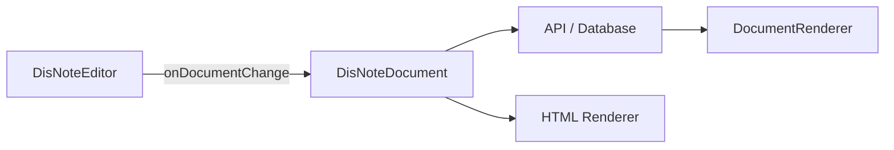
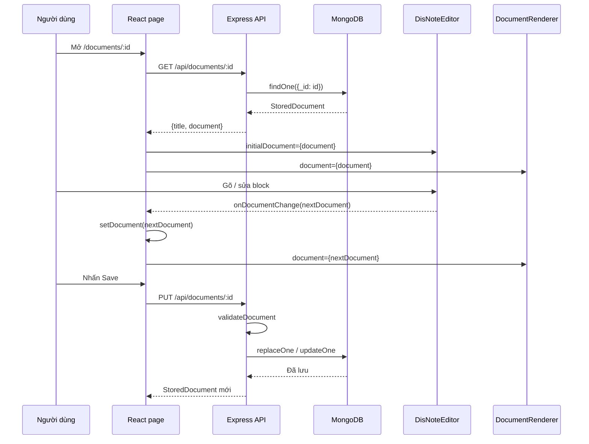

# Hướng dẫn sử dụng `@disnote/core`

Tài liệu này áp dụng cho `@disnote/core@0.6.0`.

> **Bạn mới dùng library?** Đừng đọc tài liệu này từ đầu đến cuối. Hãy làm
> [`Bắt đầu với DisNote Document Library`](BAT_DAU_CHO_NGUOI_MOI.md) trước.
> Tài liệu đó giải thích sự khác nhau giữa hàm và component, ý nghĩa từng prop,
> rồi xây một editor + preview tối thiểu từng bước. File hiện tại dùng để tra
> cứu sau khi bạn đã chạy được ví dụ đầu tiên.

Tài liệu gồm hai phần:

- Phần I hướng dẫn luồng DB → editor → lưu draft → render published.
- Phần II dùng để tra cứu component, props và từng nhóm public API.

Mục tiêu của hướng dẫn là tạo được một màn hình có:

- editor để nhập nội dung;
- preview cập nhật ngay khi gõ;
- nút lưu document dưới dạng JSON;
- trang published chỉ render nội dung, không tải editor.

Nếu bạn mới dùng library, hãy làm lần lượt từ mục 1 đến mục 7.

## 1. Hiểu đúng luồng dữ liệu

Ứng dụng chỉ lưu một loại dữ liệu: `DisNoteDocument`.



Ba quy tắc quan trọng:

1. Editor nhận `DisNoteDocument` làm nội dung ban đầu.
2. Mỗi lần người dùng chỉnh sửa, editor trả về một `DisNoteDocument` mới.
3. Database lưu JSON `DisNoteDocument`, không lưu BlockNote JSON hoặc HTML.

BlockNote chỉ là engine nằm bên trong editor. Code ứng dụng không cần import hay
gọi API BlockNote.

## 2. Cài đặt

### 2.1. Ứng dụng có editor React

```bash
npm install @disnote/core@0.6.0 \
  @blocknote/core@0.52.1 \
  @blocknote/react@0.52.1 \
  @blocknote/mantine@0.52.1 \
  @blocknote/xl-multi-column@0.52.1 \
  react react-dom
```

Ba package BlockNote là runtime peer dependency của editor. Bạn chỉ cài chúng;
code ứng dụng vẫn import hoàn toàn từ `@disnote/core`.

### 2.2. Ứng dụng chỉ render document

```bash
npm install @disnote/core@0.6.0 react react-dom
```

Nếu không dùng editor, bạn không cần cài BlockNote.

## 3. Tạo document mẫu

Tạo file `src/document-template.ts`:

```ts
import {
  callout,
  checklistItem,
  createDocument,
  heading,
  paragraph,
  text,
} from "@disnote/core";

export function createInitialDocument() {
  return createDocument({
    metadata: {
      title: "Tài liệu đầu tiên",
      description: "Tạo bằng DisNote Document Library",
      locale: "vi",
    },
    blocks: [
      heading(1, [text("Tài liệu đầu tiên")]),
      paragraph([
        text("Bạn có thể chỉnh sửa nội dung này trong editor."),
      ]),
      callout([
        text("Preview bên phải sẽ cập nhật ngay khi nội dung thay đổi."),
      ], "info"),
      checklistItem([text("Tạo document")], true),
      checklistItem([text("Lưu document vào database")], false),
    ],
  });
}
```

`createDocument` tự tạo:

- ID của document;
- ID của từng block;
- `format: "disnote-document"`;
- `schemaVersion`;
- `createdAt` và `updatedAt`.

Bạn không cần tự sinh các giá trị này.

## 4. Tạo editor và preview

Tạo file `src/DocumentWorkspace.tsx`:

```tsx
import { useState } from "react";
import {
  articleRegistry,
  type DisNoteDocument,
} from "@disnote/core";
import { DisNoteEditor } from "@disnote/core/editor/react";
import { DocumentRenderer } from "@disnote/core/renderer/react";
import { createInitialDocument } from "./document-template";

export function DocumentWorkspace() {
  // initialDocument chỉ được tạo một lần khi component mount.
  const [initialDocument] = useState(createInitialDocument);

  // document là source of truth của màn hình.
  const [document, setDocument] =
    useState<DisNoteDocument>(initialDocument);

  function saveToBrowser() {
    localStorage.setItem(
      "my-disnote-document",
      JSON.stringify(document),
    );
  }

  return (
    <main className="document-workspace">
      <section>
        <h2>Editor</h2>

        <DisNoteEditor
          initialDocument={initialDocument}
          onDocumentChange={setDocument}
          theme="light"
        />

        <button type="button" onClick={saveToBrowser}>
          Lưu document
        </button>
      </section>

      <section>
        <h2>Preview</h2>

        <DocumentRenderer
          document={document}
          registry={articleRegistry}
          mode="preview"
        />
      </section>
    </main>
  );
}
```

Điểm quan trọng nhất nằm ở dòng:

```tsx
onDocumentChange={setDocument}
```

Khi người dùng nhập nội dung:

1. `DisNoteEditor` tạo document mới;
2. `setDocument` cập nhật React state;
3. `DocumentRenderer` nhận state mới;
4. preview render lại.

Không cần đọc DOM của editor và không cần chuyển đổi BlockNote JSON.

### CSS bố cục tối thiểu

```css
.document-workspace {
  display: grid;
  grid-template-columns: minmax(0, 1fr) minmax(0, 1fr);
  gap: 24px;
}

.document-workspace > section {
  min-width: 0;
  padding: 20px;
  border: 1px solid #e5e7eb;
  border-radius: 12px;
}

@media (max-width: 900px) {
  .document-workspace {
    grid-template-columns: 1fr;
  }
}
```

## 5. Luồng hoàn chỉnh: MongoDB → editor → lưu lại

Đây là phần quan trọng nhất của tài liệu.

Library không tự kết nối database. Mỗi thành phần chỉ có một nhiệm vụ:

| Thành phần | Nhiệm vụ |
|---|---|
| MongoDB | Lưu JSON `DisNoteDocument` |
| Express API | Đọc, validate và ghi document |
| React component | Gọi API và giữ document trong state |
| `DisNoteEditor` | Soạn thảo và phát document mới qua callback |
| `DocumentRenderer` | Render document được truyền vào |

### 5.1. Trình tự khi mở và chỉnh sửa document



Điểm cần nhớ:

- editor không gọi MongoDB;
- renderer không gọi MongoDB;
- React page gọi API rồi truyền kết quả vào editor/renderer;
- nội dung chưa lưu nằm trong React state;
- khi nhấn Save, React state được gửi về API.

### 5.2. Cấu trúc record trong MongoDB

Collection có thể lưu record như sau:

```ts
import type { DisNoteDocument } from "@disnote/core";

export interface StoredDocument {
  _id: string;
  title: string;
  document: DisNoteDocument;
  createdAt: string;
  updatedAt: string;
}
```

Ví dụ record thực tế:

```json
{
  "_id": "doc_abc123",
  "title": "Kế hoạch sản phẩm",
  "document": {
    "format": "disnote-document",
    "schemaVersion": 1,
    "id": "doc_abc123",
    "blocks": [
      {
        "id": "block_1",
        "type": "heading",
        "version": 1,
        "props": { "level": 1 },
        "content": [
          { "type": "text", "text": "Kế hoạch sản phẩm" }
        ]
      }
    ],
    "metadata": {
      "title": "Kế hoạch sản phẩm",
      "createdAt": "2026-07-26T00:00:00.000Z",
      "updatedAt": "2026-07-26T00:00:00.000Z"
    }
  },
  "createdAt": "2026-07-26T00:00:00.000Z",
  "updatedAt": "2026-07-26T00:00:00.000Z"
}
```

`document` là field quan trọng. Không thay nó bằng HTML hoặc dữ liệu lấy từ
BlockNote.

### 5.3. Repository đọc và lưu MongoDB

Tạo file `server/document-repository.ts`:

```ts
import type { Collection, Db } from "mongodb";
import {
  articleRegistry,
  validateDocument,
  type DisNoteDocument,
} from "@disnote/core";

export interface StoredDocument {
  _id: string;
  title: string;
  document: DisNoteDocument;
  createdAt: string;
  updatedAt: string;
}

export class DocumentRepository {
  private readonly collection: Collection<StoredDocument>;

  constructor(database: Db) {
    this.collection =
      database.collection<StoredDocument>("documents");
  }

  async findById(id: string) {
    return this.collection.findOne({ _id: id });
  }

  async save(input: {
    id: string;
    title: unknown;
    document: unknown;
  }): Promise<StoredDocument> {
    if (typeof input.title !== "string") {
      throw new Error("Title phải là string.");
    }

    const title = input.title.trim().slice(0, 160);

    if (!title) {
      throw new Error("Title không được để trống.");
    }

    // Không tin dữ liệu gửi từ browser.
    const validation = validateDocument(input.document, {
      registry: articleRegistry,
      maxDepth: 8,
      strictUnknownBlocks: true,
    });

    if (!validation.ok) {
      throw new Error(
        validation.issues
          .map((issue) =>
            `${issue.path}: ${issue.message}`
          )
          .join("; "),
      );
    }

    if (validation.value.id !== input.id) {
      throw new Error(
        "Route id và document.id không trùng nhau.",
      );
    }

    const now = new Date().toISOString();
    const previous = await this.findById(input.id);

    const record: StoredDocument = {
      _id: input.id,
      title,
      document: {
        ...validation.value,
        metadata: {
          ...validation.value.metadata,
          title,
          updatedAt: now,
        },
      },
      createdAt: previous?.createdAt ?? now,
      updatedAt: now,
    };

    await this.collection.replaceOne(
      { _id: input.id },
      record,
      { upsert: true },
    );

    return record;
  }
}
```

### 5.4. Express API

Tạo route GET để lấy record từ database:

```ts
app.get("/api/documents/:id", async (request, response) => {
  const record = await repository.findById(
    request.params.id,
  );

  if (!record) {
    response.status(404).json({
      message: "Document not found",
    });
    return;
  }

  response.json(record);
});
```

Tạo route PUT để lưu state hiện tại của editor:

```ts
app.put("/api/documents/:id", async (request, response) => {
  const record = await repository.save({
    id: request.params.id,
    title: request.body?.title,
    document: request.body?.document,
  });

  response.json(record);
});
```

Request lưu document có dạng:

```json
{
  "title": "Kế hoạch sản phẩm",
  "document": {
    "format": "disnote-document",
    "schemaVersion": 1,
    "id": "doc_abc123",
    "blocks": [],
    "metadata": {
      "title": "Kế hoạch sản phẩm",
      "createdAt": "2026-07-26T00:00:00.000Z",
      "updatedAt": "2026-07-26T00:00:00.000Z"
    }
  }
}
```

### 5.5. Frontend API client

Tạo file `src/api/documents.ts`:

```ts
import type { DisNoteDocument } from "@disnote/core";

export interface StoredDocument {
  _id: string;
  title: string;
  document: DisNoteDocument;
  createdAt: string;
  updatedAt: string;
}

export async function getDocument(
  id: string,
): Promise<StoredDocument> {
  const response = await fetch(
    `/api/documents/${encodeURIComponent(id)}`,
  );

  if (!response.ok) {
    throw new Error("Không thể tải document");
  }

  return response.json() as Promise<StoredDocument>;
}

export async function saveDocument(
  document: DisNoteDocument,
): Promise<StoredDocument> {
  const response = await fetch(
    `/api/documents/${encodeURIComponent(document.id)}`,
    {
      method: "PUT",
      headers: {
        "content-type": "application/json",
      },
      body: JSON.stringify({
        title: document.metadata.title ?? "Untitled",
        document,
      }),
    },
  );

  if (!response.ok) {
    throw new Error("Không thể lưu document");
  }

  return response.json() as Promise<StoredDocument>;
}
```

### 5.6. React page tải DB, mount editor và save

Đây là component kết nối mọi phần với nhau:

```tsx
import {
  useEffect,
  useState,
} from "react";
import {
  articleRegistry,
  type DisNoteDocument,
} from "@disnote/core";
import { DisNoteEditor } from "@disnote/core/editor/react";
import {
  DocumentRenderer,
} from "@disnote/core/renderer/react";
import {
  getDocument,
  saveDocument,
} from "./api/documents";

interface DocumentPageProps {
  documentId: string;
}

export function DocumentPage({
  documentId,
}: DocumentPageProps) {
  const [document, setDocument] =
    useState<DisNoteDocument | null>(null);
  const [loading, setLoading] = useState(true);
  const [dirty, setDirty] = useState(false);
  const [saving, setSaving] = useState(false);
  const [error, setError] = useState("");

  // Chạy khi mở trang hoặc khi documentId thay đổi.
  useEffect(() => {
    let cancelled = false;

    setLoading(true);
    setDocument(null);
    setError("");

    void getDocument(documentId)
      .then((stored) => {
        if (cancelled) return;

        // stored.document chính là JSON lấy từ MongoDB.
        setDocument(stored.document);
        setDirty(false);
      })
      .catch((reason: unknown) => {
        if (cancelled) return;
        setError(
          reason instanceof Error
            ? reason.message
            : "Không thể tải document",
        );
      })
      .finally(() => {
        if (!cancelled) setLoading(false);
      });

    return () => {
      cancelled = true;
    };
  }, [documentId]);

  function handleEditorChange(
    nextDocument: DisNoteDocument,
  ) {
    // Đây là draft mới nhất, chưa lưu xuống DB.
    setDocument(nextDocument);
    setDirty(true);
  }

  async function handleSave() {
    if (!document) return;

    setSaving(true);
    setError("");

    try {
      // Gửi draft hiện tại xuống PUT API.
      const stored = await saveDocument(document);

      // Server có thể chuẩn hóa metadata/updatedAt.
      setDocument(stored.document);
      setDirty(false);
    } catch (reason) {
      setError(
        reason instanceof Error
          ? reason.message
          : "Không thể lưu document",
      );
    } finally {
      setSaving(false);
    }
  }

  if (loading) {
    return <p>Đang tải document từ MongoDB...</p>;
  }

  if (error && !document) {
    return <p>{error}</p>;
  }

  if (!document) {
    return <p>Không tìm thấy document.</p>;
  }

  return (
    <main className="document-workspace">
      <section>
        <DisNoteEditor
          // Khi đổi document.id, editor cũ được hủy
          // và editor mới nhận initialDocument mới.
          key={document.id}
          initialDocument={document}
          onDocumentChange={handleEditorChange}
        />

        <button
          type="button"
          disabled={!dirty || saving}
          onClick={() => void handleSave()}
        >
          {saving
            ? "Đang lưu..."
            : dirty
              ? "Lưu thay đổi"
              : "Đã lưu"}
        </button>

        {error && <p>{error}</p>}
      </section>

      <section>
        <DocumentRenderer
          // Preview luôn dùng draft mới nhất trong state.
          document={document}
          registry={articleRegistry}
          mode="preview"
        />
      </section>
    </main>
  );
}
```

### 5.7. Logic khi người dùng gõ

Giả sử MongoDB trả về document A:

```text
MongoDB document A
        ↓ GET
React state = A
        ↓ initialDocument
DisNoteEditor hiển thị A
```

Khi người dùng gõ một ký tự:

```text
DisNoteEditor xử lý thao tác
        ↓
adapter chuyển editor state thành DisNoteDocument B
        ↓ onDocumentChange(B)
React state = B
        ↓
DocumentRenderer render B
```

Lúc này MongoDB vẫn giữ A. Chỉ khi nhấn Save:

```text
React state B
        ↓ PUT /api/documents/:id
backend validate B
        ↓
MongoDB thay A bằng B
```

### 5.8. Tại sao phải chờ GET xong mới mount editor?

`initialDocument` là dữ liệu khởi tạo, không phải controlled value.

Không nên:

```tsx
// Sai: editor mount với document rỗng trước khi GET hoàn tất.
<DisNoteEditor initialDocument={document ?? emptyDocument} />
```

Nên:

```tsx
if (!document) {
  return <p>Đang tải...</p>;
}

return (
  <DisNoteEditor
    key={document.id}
    initialDocument={document}
    onDocumentChange={setDocument}
  />
);
```

Không dùng `key={JSON.stringify(document)}` vì editor sẽ bị remount sau mỗi ký
tự. Chỉ dùng `key={document.id}` để remount khi chuyển sang document khác.

## 6. Tạo trang published

Trang published cũng gọi GET API, nhưng chỉ truyền document vào renderer. Nó
không import hoặc tải editor.

```tsx
import { useEffect, useState } from "react";
import {
  articleRegistry,
  validateDocument,
  type DisNoteDocument,
} from "@disnote/core";
import { DocumentRenderer } from "@disnote/core/renderer/react";
import { getDocument } from "./api/documents";

export function PublishedPage({
  documentId,
}: {
  documentId: string;
}) {
  const [document, setDocument] =
    useState<DisNoteDocument | null>(null);
  const [error, setError] = useState("");

  useEffect(() => {
    setDocument(null);
    setError("");

    void getDocument(documentId)
      .then((stored) => {
        // Validate lại dữ liệu tại boundary của UI.
        const result = validateDocument(stored.document, {
          registry: articleRegistry,
          maxDepth: 4,
        });

        if (!result.ok) {
          throw new Error("Document không hợp lệ");
        }

        setDocument(result.value);
      })
      .catch((reason: unknown) => {
        setError(
          reason instanceof Error
            ? reason.message
            : "Không thể tải document",
        );
      });
  }, [documentId]);

  if (error) {
    return <p>{error}</p>;
  }

  if (!document) {
    return <p>Đang tải...</p>;
  }

  return (
    <article>
      <DocumentRenderer
        document={document}
        registry={articleRegistry}
        mode="published"
        assetResolver={(assetId) =>
          `/api/assets/${assetId}`
        }
      />
    </article>
  );
}
```

Luồng đầy đủ lúc này là:

```text
Editor
  → onDocumentChange
  → React state
  → PUT /api/documents/:id
  → database.document
  → GET published document
  → validateDocument
  → DocumentRenderer
```

Ví dụ trên render bản mới nhất đã lưu. Nếu sản phẩm cần quy trình draft/publish
thật sự, record nên có `currentRevision` và `publishedRevision`; trang editor đọc
draft hiện tại, còn trang public chỉ đọc revision đã publish.

## 7. Dùng trong Next.js

Editor cần chạy ở client:

```tsx
"use client";

import { DisNoteEditor } from "@disnote/core/editor/react";
```

Trang published có thể là Server Component nếu document được đọc ở server.
Không import `@disnote/core/editor/react` vào Server Component.

Ví dụ:

```tsx
import { articleRegistry } from "@disnote/core";
import { DocumentRenderer } from "@disnote/core/renderer/react";

export default async function Page() {
  const document = await getPublishedDocument();

  return (
    <DocumentRenderer
      document={document}
      registry={articleRegistry}
      mode="published"
    />
  );
}
```

## 8. Tạo các block

Các builder thường dùng:

```ts
import {
  bulletListItem,
  callout,
  checklistItem,
  codeBlock,
  divider,
  heading,
  image,
  numberedListItem,
  paragraph,
  quote,
  text,
  toggle,
} from "@disnote/core";

const blocks = [
  heading(2, [text("Tiêu đề")]),
  paragraph([
    text("Chữ thường, "),
    text("in đậm", [{ type: "bold" }]),
    text(" và "),
    text("in nghiêng", [{ type: "italic" }]),
  ]),
  bulletListItem([text("Danh sách dấu chấm")]),
  numberedListItem([text("Danh sách đánh số")]),
  checklistItem([text("Việc cần làm")], false),
  quote([text("Trích dẫn")]),
  codeBlock("const ready = true;", "ts"),
  callout([text("Cảnh báo")], "warning"),
  image("asset-id", "Mô tả ảnh"),
  divider(),
  toggle(
    [text("Mở nội dung")],
    [paragraph([text("Nội dung bên trong")])],
  ),
];
```

Thêm block vào document:

```ts
import {
  appendBlock,
  paragraph,
  text,
  type DisNoteDocument,
} from "@disnote/core";

function addParagraph(document: DisNoteDocument) {
  const result = appendBlock(
    document,
    paragraph([text("Đoạn văn mới")]),
  );

  if (!result.ok) {
    throw new Error(result.error.message);
  }

  return result.document;
}
```

Các transformation không mutate document cũ. Hãy dùng document nằm trong
`result.document`.

## 9. Paste từ VS Code hoặc Markdown

Trong `DisNoteEditor`, người dùng chỉ cần nhấn `Ctrl+V`. Editor tự xử lý:

- plain text;
- Markdown source;
- HTML;
- nội dung copy từ VS Code Markdown Preview;
- heading, list lồng nhau, quote, code, table, link và inline formatting.

Không cần viết `onPaste` trong ứng dụng.

Nếu đang làm màn hình import riêng:

```ts
import {
  importHtml,
  importMarkdown,
} from "@disnote/core/import-export";

const markdownResult = importMarkdown(`
# Tiêu đề

- Mục một
- Mục hai
`);

const htmlResult = importHtml(`
  <h1>Tiêu đề</h1>
  <p>Nội dung <strong>in đậm</strong>.</p>
`);
```

Mỗi kết quả có:

```ts
result.document;
result.warnings;
```

Hãy kiểm tra `warnings` vì import/export có thể làm mất một số định dạng không
tương thích.

## 10. Render HTML ở backend

Khi cần email, SEO HTML hoặc nội dung không dùng React:

```ts
import { articleRegistry } from "@disnote/core";
import {
  renderDocumentToHtml,
} from "@disnote/core/renderer/html";

const result = renderDocumentToHtml({
  document,
  registry: articleRegistry,
  policy: {
    resolveAssetUrl: (assetId) =>
      `https://cdn.example.com/${assetId}`,
    link: {
      allowedSchemes: ["https:", "mailto:"],
      allowHttp: false,
    },
  },
});

console.log(result.html);
console.log(result.plainText);
console.log(result.headings);
console.log(result.warnings);
```

HTML renderer escape nội dung và loại URL không an toàn.

## 11. Chọn registry nào

Library có ba registry dựng sẵn:

| Registry | Khi nào dùng |
|---|---|
| `articleRegistry` | Bài viết, landing page, product update |
| `legalRegistry` | Điều khoản, chính sách và nội dung pháp lý |
| `workspaceRegistry` | Document nội bộ, comments và collaboration |

Editor, validation và renderer của cùng một use case nên dùng cùng registry.

Ví dụ article:

```ts
validateDocument(input, { registry: articleRegistry });

<DocumentRenderer
  document={document}
  registry={articleRegistry}
/>
```

## 12. Lỗi thường gặp

### `Cannot find module "@blocknote/..."`

Nguyên nhân: ứng dụng dùng editor nhưng chưa cài peer dependencies.

```bash
npm install \
  @blocknote/core@0.52.1 \
  @blocknote/react@0.52.1 \
  @blocknote/mantine@0.52.1
```

### Editor thay đổi nhưng preview không cập nhật

Kiểm tra editor có truyền callback:

```tsx
<DisNoteEditor
  initialDocument={initialDocument}
  onDocumentChange={setDocument}
/>
```

Và renderer phải dùng `document` state, không dùng lại `initialDocument`:

```tsx
<DocumentRenderer
  document={document}
  registry={articleRegistry}
/>
```

### Đổi document nhưng editor vẫn hiện document cũ

`initialDocument` chỉ dùng khi editor được tạo. Khi đổi sang document khác:

```tsx
<DisNoteEditor
  key={document.id}
  initialDocument={document}
  onDocumentChange={setDocument}
/>
```

### Nâng library nhưng app vẫn dùng bản cũ

```bash
npm install @disnote/core@latest
npm ls @disnote/core
```

Sau đó dừng và chạy lại dev server.

### Document từ database không render

Kiểm tra bằng:

```ts
const result = validateDocument(data, {
  registry: articleRegistry,
});

if (!result.ok) {
  console.error(result.issues);
}
```

### Có nên lưu HTML không?

Không. Hãy lưu `DisNoteDocument` JSON. HTML chỉ là kết quả render và có thể tạo
lại bất cứ lúc nào.

## 13. Checklist tích hợp nhanh

- [ ] Cài `@disnote/core`.
- [ ] Nếu dùng editor, cài đúng ba peer dependency BlockNote.
- [ ] Tạo document bằng `createDocument`.
- [ ] Giữ document hiện tại trong React state.
- [ ] Truyền `onDocumentChange={setDocument}` cho editor.
- [ ] Lưu toàn bộ `DisNoteDocument` JSON vào API/database.
- [ ] Validate document khi backend nhận dữ liệu.
- [ ] Validate document sau khi đọc từ database.
- [ ] Render published page bằng `DocumentRenderer`.
- [ ] Không lưu BlockNote JSON hoặc HTML làm source of truth.

## 14. Các import cần nhớ

```ts
// Model, builders, validation
import {
  createDocument,
  paragraph,
  heading,
  text,
  validateDocument,
  articleRegistry,
} from "@disnote/core";

// Editor
import {
  DisNoteEditor,
} from "@disnote/core/editor/react";

// React renderer
import {
  DocumentRenderer,
} from "@disnote/core/renderer/react";

// HTML renderer
import {
  renderDocumentToHtml,
} from "@disnote/core/renderer/html";

// Import/export
import {
  importMarkdown,
  importHtml,
  exportMarkdownLossy,
} from "@disnote/core/import-export";
```

## 15. Ví dụ trong repository

- `examples/react-demo`: editor và preview React tối giản;
- `examples/nextjs-demo`: admin editor và published page;
- `examples/legal-service-nest`: backend integration;
- `examples/collaboration-server`: collaboration server.

Chạy React demo:

```bash
npm install
npm run dev --workspace @disnote/react-demo
```

---

## Phần II. Tra cứu component, props và public API

Phần dưới đây dùng để tra theo tên component hoặc function: nhận tham số gì, trả về gì và dùng trong trường hợp nào. Các ví dụ và luồng ứng dụng thực tế nằm ở phần I phía trên.

### 16. Chọn đúng import

| Nhu cầu | Import từ |
|---|---|
| Model, builders, validation, biến đổi document, registry, migration | `@disnote/core` |
| Component editor React | `@disnote/core/editor/react` |
| Adapter BlockNote cấp thấp, i18n, slash command | `@disnote/core/editor` |
| Render document bằng React | `@disnote/core/renderer/react` |
| Render document thành HTML string | `@disnote/core/renderer/html` |
| Render trong React Native | `@disnote/core/renderer/native` |
| Import/paste Markdown, HTML; export Markdown | `@disnote/core/import-export` |
| Contract lưu document/revision và repository mẫu | `@disnote/core/storage` |
| Upload và kiểm tra file ảnh | `@disnote/core/assets` |
| Comment và mention | `@disnote/core/comments` |
| Collaboration/Yjs | `@disnote/core/collaboration` |
| Search projection và thao tác AI | `@disnote/core/search-ai` |
| Luật publish và application service | `@disnote/core/legal` |
| Factory/assertion dùng trong test | `@disnote/core/testing` |
| Preset riêng | `@disnote/core/presets/article`, `/legal`, `/workspace` |

Không import trực tiếp từ `dist/...` hoặc từ file nội bộ của package. Các đường
dẫn đó không thuộc public API.

### 17. Component editor

#### `DisNoteEditor`

```tsx
import {
  DisNoteEditor,
  type DisNoteEditorHandle,
} from "@disnote/core/editor/react";
```

Đây là component soạn thảo chính. BlockNote chỉ là engine nội bộ; dữ liệu công
khai vào/ra component luôn là `DisNoteDocument`.

##### Props

| Prop | Type | Bắt buộc | Mặc định | Dùng để làm gì |
|---|---|---:|---|---|
| `initialDocument` | `DisNoteDocument` | Có | — | Document ban đầu lấy từ DB hoặc vừa tạo mới |
| `editable` | `boolean` | Không | `true` | Cho phép hoặc khóa chỉnh sửa |
| `theme` | `"light" \| "dark"` | Không | `"light"` | Theme giao diện editor |
| `onDocumentChange` | `(document: DisNoteDocument) => void` | Không | — | Nhận document mới sau mỗi thay đổi |
| `className` | `string` | Không | — | Class CSS của wrapper editor |

##### Lưu ý quan trọng về `initialDocument`

`initialDocument` là **giá trị khởi tạo**, không phải state hai chiều. Khi người
dùng gõ, component không sửa object mà bạn đã truyền vào. Hãy nhận bản mới qua
`onDocumentChange`.

Nếu chuyển sang document khác, hãy tự đặt `key={document.id}` cho
`DisNoteEditor`. `initialDocument` chỉ được BlockNote đọc lúc component được
mount; chỉ thay prop mà không remount sẽ không nạp lại nội dung.

```tsx
function EditPage({ loadedDocument }: { loadedDocument: DisNoteDocument }) {
  const [draft, setDraft] = useState(loadedDocument);

  return (
    <DisNoteEditor
      key={loadedDocument.id}
      initialDocument={loadedDocument}
      editable
      theme="light"
      onDocumentChange={setDraft}
    />
  );
}
```

##### Ref methods

Truyền `ref` kiểu `DisNoteEditorHandle` để điều khiển editor từ bên ngoài.

| Method | Trả về | Dùng để làm gì |
|---|---|---|
| `focus()` | `void` | Đưa con trỏ vào editor |
| `getDocument()` | `DisNoteDocument` | Lấy snapshot hiện tại, thường dùng khi bấm Save |
| `insertBlock(block)` | `void` | Chèn một `DisNoteBlock` vào editor |
| `setEditable(editable)` | `void` | Khóa/mở chỉnh sửa mà không dựng lại component |

```tsx
const editorRef = useRef<DisNoteEditorHandle>(null);

async function save() {
  const document = editorRef.current?.getDocument();
  if (!document) return;
  await api.saveDocument(document);
}

<DisNoteEditor ref={editorRef} initialDocument={document} />;
```

##### Tính năng hiện có

- Soạn thảo block.
- Heading, paragraph, list, checklist, quote, code, callout và các core block.
- Inline marks: bold, italic, underline, strike, code và màu.
- Link, drag/reorder, undo/redo và slash menu.
- Nhập tiếng Việt/Unicode.
- Paste plain text, Markdown và semantic HTML.
- Paste từ VS Code Markdown Preview: ưu tiên HTML để giữ heading, list, table,
  quote, link và định dạng inline.
- Chuyển đổi hai chiều giữa document công khai của DisNote và engine nội bộ.

##### Các type liên quan

```ts
interface DocumentCapabilities {
  canRead: boolean;
  canEdit: boolean;
  canComment: boolean;
  canPublish: boolean;
  canManage: boolean;
}
```

`DocumentCapabilities` là type để ứng dụng mô tả quyền. `DisNoteEditor` hiện
không nhận type này làm prop; ứng dụng tự dùng nó để quyết định `editable` và
ẩn/hiện các nút.

`DisNoteEditorHandle.getExperimentalAccess()` trả về
`ExperimentalEditorAccess` (`vendor: "blocknote"` và `getVendorEditor()`).
Đây là escape hatch không có cam kết tương thích; code production nên ưu tiên
các method ổn định của handle.

#### `Toolbar`

Toolbar trình bày một danh sách action bằng button có hỗ trợ accessibility.

```ts
interface ToolbarProps {
  i18n: I18n;
  actions: ToolbarAction[];
}

interface ToolbarAction {
  key: EditorMessageKey;
  active?: boolean;
  onToggle(): void;
  icon: ReactNode;
}
```

| Prop | Dùng để làm gì |
|---|---|
| `i18n` | Cung cấp label đã dịch cho button |
| `actions` | Danh sách nút định dạng |
| `action.key` | Key dịch, đồng thời là key React |
| `action.active` | Hiển thị trạng thái đang bật |
| `action.onToggle` | Chạy khi bấm nút |
| `action.icon` | Icon React của nút |

#### `LinkEditor`

Form nhỏ để nhập URL. Component từ chối các scheme nguy hiểm như
`javascript:`, `vbscript:`, `file:` và `data:`.

```ts
interface LinkEditorProps {
  i18n: I18n;
  initialHref?: string;       // mặc định ""
  onApply(href: string): void;
  onCancel?(): void;
}
```

#### `ImageUploadButton`

Mở file picker, upload ảnh rồi tạo một image block.

```ts
interface UploadProvider {
  upload(file: File): Promise<{ assetId: string; alt?: string }>;
}

interface ImageUploadButtonProps {
  i18n: I18n;
  uploader: UploadProvider;
  onInsert(block: DisNoteBlock): void;
}
```

`uploader` là adapter do ứng dụng cung cấp. Nó có thể gọi REST API, S3,
Cloudinary hoặc storage riêng. Component không tự lưu file vào DB.

#### `SlashMenu`

Menu chọn loại block bằng từ khóa.

```ts
interface SlashMenuProps {
  i18n: I18n;
  query: string;
  commands?: SlashCommand[]; // mặc định defaultSlashCommands
  onSelect(block: DisNoteBlock): void;
}
```

Hỗ trợ phím lên/xuống và Enter. `onSelect` nhận block vừa được command tạo.

### 18. Component render React

#### `DocumentRenderer`

```tsx
import {
  DocumentRenderer,
  type DocumentRendererProps,
} from "@disnote/core/renderer/react";
```

Component chỉ đọc và render `DisNoteDocument`; nó không tải editor và không có
logic lưu dữ liệu.

##### Props

| Prop | Type | Bắt buộc | Mặc định | Dùng để làm gì |
|---|---|---:|---|---|
| `document` | `DisNoteDocument` | Có | — | Document lấy từ API/DB |
| `registry` | `BlockRegistry` | Có | — | Cho renderer biết block type nào hợp lệ |
| `mode` | `"published" \| "preview"` | Không | `"published"` | Ngữ cảnh render |
| `theme` | `DocumentTheme` | Không | `defaultTheme` | Toàn bộ token màu |
| `referenceResolver` | `ReferenceResolver` | Không | — | Resolve reference sang label/link/quyền |
| `assetResolver` | `(assetId) => string \| undefined` | Không | — | Đổi `assetId` thành URL ảnh |
| `blockRenderers` | `ReactBlockRenderers` | Không | — | Renderer React cho custom block hoặc override core block |
| `className` | `string` | Không | `"disnote-document"` | Class wrapper |

`DocumentRenderer` giả định document đã được migrate và validate trước khi
render.

```tsx
<DocumentRenderer
  document={document}
  registry={articleRegistry}
  mode="published"
  assetResolver={(assetId) => assetUrls[assetId]}
  referenceResolver={(type, id, fallback) => ({
    status: "resolved",
    href: `/${type}/${id}`,
    label: fallback,
  })}
/>;
```

##### `DocumentTheme`

`theme` phải có đủ các màu sau:

```ts
interface DocumentTheme {
  colors: {
    background: string;
    surface: string;
    text: string;
    textMuted: string;
    border: string;
    focus: string;
    selection: string;
    link: string;
    danger: string;
  };
}
```

Có thể clone `defaultTheme` rồi thay một phần:

```ts
const theme = {
  ...defaultTheme,
  colors: { ...defaultTheme.colors, link: "#2563eb" },
};
```

##### `ReferenceResolver`

```ts
type ReferenceResolution =
  | { status: "resolved"; href?: string; label: string }
  | { status: "forbidden"; label: string }
  | { status: "missing"; label: string };

type ReferenceResolver = (
  targetType: string,
  targetId: string,
  fallbackLabel: string,
) => ReferenceResolution;
```

Resolver này phù hợp với dữ liệu đã có sẵn ở client. Nếu phải gọi API bất đồng
bộ, hãy resolve trước rồi truyền một cache/map đồng bộ vào renderer.

##### Custom React block renderer

```ts
interface ReactBlockRendererApi {
  block: DisNoteBlock;
  renderInline(content?: DisNoteInline[]): ReactNode;
  renderChildren(blocks?: DisNoteBlock[]): ReactNode;
}

type ReactBlockRenderers =
  Readonly<Record<string, (api: ReactBlockRendererApi) => ReactNode>>;
```

```tsx
const blockRenderers = {
  "acme.product": ({ block, renderChildren }) => (
    <ProductCard productId={String(block.props.productId)}>
      {renderChildren(block.children)}
    </ProductCard>
  ),
};
```

Các component cấp thấp:

| Component | Props | Dùng để làm gì |
|---|---|---|
| `BlockList` | `{ blocks: DisNoteBlock[] }` | Render một danh sách block và gom các list item liên tiếp |
| `BlockRenderer` | `{ block: DisNoteBlock }` | Render một block |
| `InlineRenderer` | `{ content: DisNoteInline[] \| undefined }` | Render text, mark, link, mention và reference |
| `UnknownBlock` | `{ block, reason }` | Fallback read-only cho block chưa hỗ trợ |

`UnknownBlock.reason` là `"unregistered"`, `"unsupported-version"` hoặc
`"invalid"`.

Các component trên cùng `DocumentRenderContext` và
`useDocumentRenderContext()` dùng khi bạn xây renderer wrapper riêng. Chúng
phải nằm bên trong `DocumentRenderer` hoặc một
`DocumentRenderContext.Provider` hợp lệ; hook sẽ throw nếu không tìm thấy
context.

### 19. Renderer HTML và React Native

#### `renderDocumentToHtml`

```ts
const result = renderDocumentToHtml({
  document,
  registry: articleRegistry,
  policy: {
    link: {
      allowedSchemes: ["https:", "mailto:"],
      allowHttp: false,
    },
    resolveAssetUrl: (assetId) => assetMap[assetId],
    blockRenderers: customHtmlRenderers,
  },
});
```

Input:

```ts
interface RenderDocumentToHtmlInput {
  document: DisNoteDocument;
  registry: BlockRegistry;
  policy?: HtmlRenderPolicy;
}
```

Kết quả:

| Field | Ý nghĩa |
|---|---|
| `html` | HTML string an toàn để render/SSR |
| `plainText` | Text dùng cho search, excerpt |
| `headings` | Danh sách heading và block ID |
| `assets` | Các `assetId` được document sử dụng |
| `warnings` | Unknown block hoặc URL không an toàn |

Các helper liên quan:

| API | Dùng để làm gì |
|---|---|
| `escapeHtml(input)` | Escape text trước khi đưa vào HTML |
| `safeHref(href, policy?)` | Trả URL an toàn hoặc `null` |
| `safeColor(value)` | Kiểm tra giá trị màu trước khi đưa vào style |

Custom HTML renderer nhận `{ block, renderInline, renderChildren, escape }` và
trả một HTML string.

#### `DocumentNativeRenderer`

```ts
interface DocumentNativeRendererProps {
  document: DisNoteDocument;
  primitives: {
    View: ComponentType;
    Text: ComponentType;
    Image: ComponentType;
  };
  assetResolver?: (assetId: string) => string | undefined;
  blockRenderers?: NativeBlockRenderers;
  style?: unknown;
}
```

`primitives` thường là `View`, `Text`, `Image` import từ `react-native`. Cách
này giúp package không buộc phụ thuộc trực tiếp vào React Native.

`projectForNative(document)` trả mảng `{ blockId, type, text, depth }`, phù hợp
cho accessibility preview, search hoặc giao diện native đơn giản không cần full
renderer.

### 20. Model dữ liệu

#### `DisNoteDocument`

```ts
interface DisNoteDocument {
  format: "disnote-document";
  schemaVersion: number;
  id: string;
  blocks: DisNoteBlock[];
  metadata: DocumentMetadata;
}
```

#### `DocumentMetadata`

| Field | Type | Ý nghĩa |
|---|---|---|
| `title` | `string?` | Tiêu đề |
| `description` | `string?` | Mô tả |
| `locale` | `"en" \| "vi"?` | Ngôn ngữ |
| `createdAt` | `string` | ISO datetime tạo |
| `updatedAt` | `string` | ISO datetime cập nhật |
| `createdBy` | `string?` | User ID người tạo |
| `tags` | `string[]?` | Tag |
| `attributes` | `Record<string, JsonValue>?` | Metadata mở rộng của ứng dụng |

#### `DisNoteBlock`

```ts
interface DisNoteBlock {
  id: string;
  type: string;
  version: number;
  props: Record<string, JsonValue>;
  content?: DisNoteInline[];
  children?: DisNoteBlock[];
}
```

- `props`: dữ liệu đặc thù của block.
- `content`: text/link/mention/reference trong một dòng.
- `children`: block con.
- `version`: version riêng của block type, dùng cho migration.

#### JSON types và constants

| API | Dùng để làm gì |
|---|---|
| `JsonPrimitive` | `string \| number \| boolean \| null` |
| `JsonValue` | Primitive, array hoặc object JSON lồng nhau |
| `JsonObject` | Object có các value thuộc `JsonValue` |
| `isJsonValue(value)` | Type guard kiểm tra một giá trị có lưu an toàn trong JSON được không |
| `DOCUMENT_FORMAT` | Hằng `"disnote-document"` |
| `CURRENT_SCHEMA_VERSION` | Schema document mới nhất mà bản library hỗ trợ |

#### Inline content

| Type | Field chính | Dùng để làm gì |
|---|---|---|
| `TextInline` | `text`, `marks?` | Text thường và định dạng |
| `LinkInline` | `href`, `content` | Link chứa các text node |
| `MentionInline` | `entityType`, `entityId`, `label` | Mention user/channel |
| `InlineReference` | `targetType`, `targetId`, `label` | Tham chiếu task/document/message/file |

`TextMark` hỗ trợ `bold`, `italic`, `underline`, `strike`, `code`,
`textColor` và `backgroundColor`.

### 21. Builders: tạo document và block

```ts
import {
  createDocument,
  heading,
  paragraph,
  text,
} from "@disnote/core";

const document = createDocument({
  id: "doc_123",
  metadata: { title: "Hướng dẫn", locale: "vi" },
  blocks: [
    heading(1, [text("Hướng dẫn")]),
    paragraph([text("Nội dung "), text("quan trọng", [{ type: "bold" }])]),
  ],
});
```

#### Inline builders

| Function | Signature rút gọn | Kết quả |
|---|---|---|
| `text` | `(value, marks?)` | `TextInline` |
| `link` | `(href, textContent[])` | `LinkInline` |
| `mention` | `(entityType, entityId, label)` | `MentionInline` |
| `reference` | `(targetType, targetId, label)` | `InlineReference` |

#### Block builders

| Function | Tham số | Block tạo ra |
|---|---|---|
| `paragraph` | `(content?, init?)` | `paragraph` |
| `heading` | `(level: 1|2|3, content?, init?)` | `heading` |
| `bulletListItem` | `(content?, children?)` | Item danh sách chấm |
| `numberedListItem` | `(content?, children?)` | Item danh sách số |
| `checklistItem` | `(content?, checked=false)` | Checklist |
| `toggle` | `(content?, children?)` | Nội dung thu gọn/mở rộng |
| `quote` | `(content?)` | Trích dẫn |
| `codeBlock` | `(code, language="text")` | Khối code |
| `image` | `(assetId, alt="", extra={})` | Ảnh tham chiếu asset |
| `divider` | `()` | Đường phân cách |
| `callout` | `(content?, intent="info")` | Ghi chú info/warning/success/danger |
| `customBlock` | `(type, version, init?)` | Block do ứng dụng định nghĩa |

`createDocument({ id?, blocks?, metadata?, now? })` tự thêm format,
schemaVersion, ID và timestamp còn thiếu.

`createId(prefix?)`, `createDocumentId()` tạo ID. `setIdGenerator(fn)` chỉ nên
dùng để inject ID deterministic trong test.

### 22. Các core block và props

| `type` | `props` chính | Có inline | Có children | Mục đích |
|---|---|:---:|:---:|---|
| `paragraph` | `{}` | Có | Không | Đoạn văn |
| `heading` | `{ level: 1|2|3 }` | Có | Không | Tiêu đề |
| `bulletListItem` | `{}` | Có | Có | Item danh sách chấm |
| `numberedListItem` | `{}` | Có | Có | Item danh sách số |
| `toggle` | `{}` | Có | Có | Khối thu gọn |
| `checklistItem` | `{ checked: boolean }` | Có | Có | Công việc cần làm |
| `quote` | `{}` | Có | Không | Trích dẫn |
| `codeBlock` | `{ code, language }` | Không | Không | Source code |
| `image` | `{ assetId, alt, ...extra }` | Không | Không | Ảnh |
| `divider` | `{}` | Không | Không | Đường phân cách |
| `callout` | `{ intent }` | Có | Có | Hộp ghi chú |
| `table` | `{ rows }` | Không | Không | Bảng, dữ liệu grid nằm trong props |
| `math` | `{ code }` | Không | Không | Công thức |
| `tableOfContents` | `{}` | Không | Không | Mục lục |
| `breadcrumb` | `{}` | Không | Không | Breadcrumb |
| `syncedBlock` | `{ syncedBlockId }` | Có | Có | Khối đồng bộ |
| `templateButton` | `{ label, ... }` | Có | Có | Nút template |
| `toggleHeading1/2/3` | `{}` | Có | Có | Heading có thể thu gọn |
| `bookmark` | `{ url, title, description, image }` | Không | Không | Bookmark URL |
| `video` | `{ url, caption, name, width? }` | Không | Không | Video |
| `audio` | `{ url, caption, name, width? }` | Không | Không | Audio |
| `file` | `{ url, caption, name, width? }` | Không | Không | File đính kèm |
| `tableDb` | `{ databaseId, title, ... }` | Không | Không | Database dạng bảng |
| `board` | `{ databaseId, title, ... }` | Không | Không | Database dạng board |
| `listDb` | `{ databaseId, title, ... }` | Không | Không | Database dạng list |
| `gallery` | `{ databaseId, title, ... }` | Không | Không | Database dạng gallery |
| `calendar` | `{ databaseId, title, ... }` | Không | Không | Database dạng calendar |
| `timeline` | `{ databaseId, title, ... }` | Không | Không | Database dạng timeline |
| `map` | `{ databaseId, title, ... }` | Không | Không | Database dạng map |

Không phải mọi core block đều có UI chỉnh sửa giàu tính năng như Notion ở
phiên bản hiện tại. Registry đảm bảo model/validation; editor và từng renderer
vẫn cần hỗ trợ tương ứng để có trải nghiệm hoàn chỉnh.

### 23. Biến đổi document

Các function dưới đây không sửa object cũ. Chúng trả document mới.

```ts
type TransformResult =
  | { ok: true; document: DisNoteDocument; changedBlockIds: string[] }
  | { ok: false; error: DocumentTransformError };
```

| Function | Dùng để làm gì |
|---|---|
| `insertBlock(document, { block, parentId?, index? })` | Chèn block ở root hoặc vào một parent |
| `appendBlock(document, block)` | Thêm block cuối root |
| `updateBlock(document, blockId, patch)` | Cập nhật type/version/props/content/children, giữ nguyên ID |
| `replaceBlock(document, blockId, replacement)` | Thay toàn bộ block |
| `removeBlock(document, blockId)` | Xóa block |
| `moveBlock(document, blockId, { parentId?, index? })` | Di chuyển block |
| `wrapBlocks(document, blockIds, wrapper)` | Bọc các sibling liên tiếp vào một wrapper |
| `mapBlocks(document, mapper)` | Map đệ quy mọi block |

Luôn kiểm tra `result.ok` trước khi dùng `result.document`.

#### Selection

| Function | Dùng để làm gì |
|---|---|
| `getBlocksInRange(doc, selection)` | Lấy block từ anchor đến focus |
| `deleteBlocksInRange(doc, selection)` | Xóa toàn bộ range |
| `changeBlocksTypeInRange(doc, selection, type, props?)` | Đổi type/props hàng loạt |

`BlockSelection` gồm `anchorBlockId` và `focusBlockId`.

### 24. Duyệt, tìm và đọc document

| Function | Trả về / tác dụng |
|---|---|
| `visitBlocks(document, visitor)` | Duyệt cây theo preorder; visitor nhận block, parent, index, depth |
| `findBlock(document, id)` | Block hoặc `null` |
| `collectBlockIds(document)` | Tất cả block ID |
| `maxDepth(document)` | Độ sâu lớn nhất |
| `findDuplicateIds(document)` | Các ID bị trùng |
| `extractInlineText(content)` | Text của inline nodes |
| `extractHeadings(document)` | `{ level, text, blockId }[]` |
| `extractDocumentPlainText(document, registry?)` | Toàn bộ document thành plain text |
| `canonicalJson(value)` | JSON có thứ tự key ổn định |
| `checksum(document)` | SHA-256 của canonical document |
| `sha256Hex(message)` | SHA-256 cho string bất kỳ |

### 25. Validation, registry và preset

#### `validateDocument` và `validateBlock`

```ts
validateDocument(input, {
  registry,
  maxDepth: 4,
  strictUnknownBlocks: false,
});
```

Kết quả là:

```ts
type ValidationResult<T> =
  | { ok: true; value: T }
  | { ok: false; issues: DocumentIssue[] };
```

| Option | Ý nghĩa |
|---|---|
| `registry` | Kiểm tra props của các block đã đăng ký |
| `maxDepth` | Giới hạn độ sâu |
| `strictUnknownBlocks` | `true` thì unknown block là lỗi; mặc định vẫn bảo toàn |

#### Registry

| API | Dùng để làm gì |
|---|---|
| `createDefaultRegistry()` | Registry chứa tất cả core block V1 |
| `createBlockRegistry(definitions?)` | Tạo registry rỗng hoặc từ danh sách definition |
| `defineCoreBlock(input)` | Định nghĩa custom block |
| `registry.has(type)` | Kiểm tra type |
| `registry.get(type)` | Lấy definition |
| `registry.list()` | Lấy definitions |
| `registry.types()` | Lấy danh sách type |
| `registry.register(definition)` | Trả registry mới có thêm definition |
| `ok`, `fail`, `issue` | Helper viết `validateProps` |

Một `CoreBlockDefinition` mô tả `type`, `version`, `capabilities`,
`validateProps`, `migrate` và `toPlainText`. Đây mới là phần model. Muốn custom
block hiển thị trên React/HTML/Native, bạn đăng ký renderer riêng cho từng nền
tảng.

#### Preset

| Preset | Max depth | Comments | Collaboration | Publishing |
|---|---:|:---:|:---:|:---:|
| `articlePreset` | 4 | Không | Không | Có |
| `legalPreset` | 3 | Không | Không | Có |
| `workspacePreset` | 10 | Có | Có | Không |

Các registry tương ứng là `articleRegistry`, `legalRegistry`,
`workspaceRegistry`. `presets` là object gom cả ba.

Nếu import từ subpath preset, tên export được rút gọn:

```ts
import {
  preset,
  registry,
} from "@disnote/core/presets/article";
```

Thay `article` bằng `legal` hoặc `workspace` khi cần.

### 26. Migration

```ts
const migrations = createMigrationRegistry()
  .registerDocumentMigration(1, 2, migrateDocument)
  .registerBlockMigration("acme.product", 1, 2, migrateProduct);

const result = migrations.migrate(oldDocument, {
  targetSchemaVersion: 2,
});
```

| Method | Dùng để làm gì |
|---|---|
| `registerDocumentMigration(from, to, fn)` | Đăng ký migration document, mỗi lần đúng một version |
| `registerBlockMigration(type, from, to, fn)` | Migration riêng của block type |
| `migrate(document, options?)` | Tạo document đã migrate và report |
| `dryRun(document, options?)` | Xem report mà không áp dụng thay đổi |

Lỗi có thể là thiếu document migration, thiếu block migration hoặc document có
schema mới hơn thư viện.

### 27. Import, paste và export

| Function | Input | Kết quả |
|---|---|---|
| `importMarkdown(markdown, { now? })` | Markdown string | `{ document, warnings }` |
| `importHtml(html, { now? })` | HTML string | `{ document, warnings }` |
| `importClipboard({ html?, text? }, { now? })` | Dữ liệu clipboard | `{ document, warnings }` |
| `exportMarkdownLossy(document)` | Document | `{ output, warnings }` |
| `parseInline(text, warningSink)` | Markdown inline | `DisNoteInline[]` |
| `parseInlineHtml(html, warningSink)` | HTML inline | `DisNoteInline[]` |

`importClipboard` ưu tiên semantic HTML. Nếu không có HTML phù hợp, nó parse
plain text như Markdown. Đây là API đứng sau trường hợp paste từ VS Code
Markdown Preview.

`InteropWarning` cho biết phần nào bị mất hoặc không hỗ trợ. Không nên bỏ qua
warnings khi import/export nội dung quan trọng.

`WarningSink` là helper cấp thấp để parser thêm warning vào `sink.list`.

### 28. Storage và revision

Subpath storage cung cấp **contract**, không tự kết nối MongoDB/PostgreSQL.
Backend của bạn implement các interface này.

#### Các interface chính

| Interface | Methods |
|---|---|
| `DocumentReader` | `getById`, `getPublishedBySlug` |
| `DraftWriter` | `saveDraft` |
| `DocumentPublisher` | `publish`, `unpublish`, `archive` |
| `RevisionReader` | `listRevisions`, `getRevision` |
| `DocumentRepository` | Gộp toàn bộ interface trên |

`SaveDraftInput` gồm:

```ts
{
  documentId: string;
  expectedRevision: number;
  document: DisNoteDocument;
  idempotencyKey: string;
  actor: string;
}
```

`expectedRevision` dùng cho optimistic concurrency. `idempotencyKey` ngăn một
request retry tạo nhiều revision.

`SaveDraftResult` trả thành công với revision mới, hoặc lỗi
`revision-conflict`/`not-found`.

#### `InMemoryDocumentRepository`

```ts
const repository = new InMemoryDocumentRepository({
  registry: articleRegistry,
  now: () => new Date().toISOString(), // optional
});
```

| Method | Dùng để làm gì |
|---|---|
| `create(input)` | Tạo stored document và revision 1 |
| `getById(id)` | Đọc metadata lưu trữ |
| `getPublishedBySlug({ slug, locale })` | Đọc đúng published revision |
| `saveDraft(input)` | Tạo revision mới |
| `publish(input)` | Trỏ publishedRevision đến một revision bất biến |
| `unpublish(input)` | Chuyển về draft |
| `archive(input)` | Archive document |
| `listRevisions(documentId)` | Liệt kê revision |
| `getRevision(documentId, revision)` | Đọc revision |

Class này chỉ dành cho demo/test; restart process là mất dữ liệu. Production
phải implement `DocumentRepository` bằng DB thật.

### 29. Asset và upload

| API | Dùng để làm gì |
|---|---|
| `detectMimeType(bytes)` | Nhận dạng MIME từ magic bytes |
| `InMemoryAssetUploader(options?)` | Uploader mẫu có kiểm tra file |
| `AssetValidationError` | Lỗi empty, MIME không cho phép, MIME mismatch, quá lớn |

`UploaderOptions`:

| Option | Mặc định | Ý nghĩa |
|---|---|---|
| `allowedMimeTypes` | PNG/JPEG/GIF/WebP | Danh sách MIME được phép |
| `maxSize` | 10 MiB | Kích thước tối đa |
| `generateKey` | Tự tạo | Inject storage key |
| `toUrl` | `memory://...` | Đổi key thành URL |

Contract production:

- `AssetUploader.upload(file, context)` trả `AssetReference`.
- `AssetResolver.resolveUrl(assetId)` trả URL hoặc `null`.
- Document chỉ lưu `assetId`; URL có thể thay đổi và được resolve lúc render.

### 30. Comments và mentions

#### `InMemoryCommentStore`

Constructor nhận `{ now?, generateId? }`.

| Method | Dùng để làm gì |
|---|---|
| `createThread(input)` | Tạo thread ở document, block hoặc inline range |
| `addComment(threadId, author, body)` | Thêm comment |
| `setStatus(threadId, "open" \| "resolved")` | Đổi trạng thái |
| `listForDocument(documentId)` | Lấy comment của document |
| `reconcile(document)` | Đánh dấu orphan nếu block anchor đã bị xóa |

Comment được lưu **ngoài** `DisNoteDocument`, vì vậy chỉnh sửa/publish content
không làm comment trở thành nội dung công khai.

#### `InMemoryMentionProvider`

Khởi tạo từ `DirectoryEntry[]`. `search(query, context)` tìm user/channel và
`resolve(entityType, entityId)` resolve mention. Production có thể implement
`MentionProvider` để gọi user service riêng.

### 31. Search và AI

#### `buildSearchProjection`

```ts
buildSearchProjection(document, registry, revision);
```

Trả `DocumentSearchProjection` gồm document ID, revision, title, plain text,
headings, references, assets và locale. Dùng object này để index Elasticsearch,
OpenSearch hoặc vector pipeline; không cần parse HTML đã render.

#### AI operations

`AIDocumentOperation` hỗ trợ:

- `insert`: block, parentId?, index?.
- `update`: blockId và `BlockPatch`.
- `remove`: blockId.
- `move`: blockId, parentId?, index?.

| Function | Dùng để làm gì |
|---|---|
| `validateOperations(document, operations)` | Kiểm tra ID/parent trước khi apply |
| `applyOperations(document, operations)` | Apply tuần tự, dừng ở lỗi đầu tiên |
| `previewDiff(before, after)` | Liệt kê block added/removed/changed |

Quyền người dùng và bước xác nhận AI là trách nhiệm của application layer.

### 32. Legal application service

Các pure function:

| Function | Dùng để làm gì |
|---|---|
| `canPublish(status)` | Không cho publish document archived |
| `canEdit(status)` | Không cho sửa document archived |
| `requiresEffectiveDate(kind)` | `LEGAL_POLICY` cần effective date |
| `readEffectiveDate(attributes)` | Đọc `attributes.effectiveDate` |

`ContentApplicationService` phối hợp validate, repository, migration, publish
rule và audit.

| Method | Kết quả |
|---|---|
| `createDraft(input)` | `Result<StoredDocument>` |
| `saveDraft(input)` | `Result<{ revision }>` |
| `publish(input)` | `Result<PublishedDocument>` |
| `unpublish(input)` | `Result<null>` |
| `archive(input)` | `Result<null>` |
| `getPublished(slug, locale)` | Published revision đã migrate + validate |
| `listRevisions(documentId)` | Revision summaries |
| `getRevision(documentId, revision)` | Một revision hoặc `null` |

Nó không phụ thuộc framework hoặc DB; truyền implementation qua
`ContentServiceDeps`.

### 33. Collaboration/Yjs

| API | Dùng để làm gì |
|---|---|
| `InMemoryUpdateStore` | Lưu update log và compact thành snapshot |
| `snapshotToRevision(document, registry)` | Validate snapshot và tạo stable revision |
| `seedYDoc(ydoc, document)` | Ghi các block của DisNote document vào một `Y.Doc` đã tạo |
| `snapshotFromYDoc(ydoc, envelope)` | Lấy block từ Y.Doc và ghép với phần document không gồm `blocks` |
| `encodeState(ydoc)` | Encode state Yjs |
| `applyUpdate(ydoc, update)` | Apply binary update |

`UpdateStoreOptions` gồm `now?`, `compactThreshold?` (mặc định 100) và
`merge?`.

`CollaborationProvider` là contract cho provider realtime:
`connect`, `disconnect`, `snapshot` và `onAwareness`. Presence/selection là
ephemeral, không được lưu vào revision.

### 34. Editor adapter cấp thấp

Thông thường chỉ cần `DisNoteEditor`. Nhóm dưới đây dành cho người xây editor
facade khác.

#### `createBlockNoteAdapter`

Trả một `EditorAdapter<BlockNoteEditorDocument>`:

| Method | Dùng để làm gì |
|---|---|
| `toEditor(document)` | Đổi DisNote document sang BlockNote shape + envelope |
| `fromEditor(editorDocument)` | Đổi ngược về DisNote document |
| `validateRoundTrip(document)` | Kiểm tra chuyển đi/về có mất dữ liệu không |

Các converter thấp hơn: `blockToBn`, `blockFromBn`, `inlineToBn`,
`inlineFromBn`.

`createI18n("vi" | "en")` trả `{ locale, t(key) }`.
`defaultSlashCommands` là command mặc định.
`filterSlashCommands(query, commands?)` lọc command theo ID và keyword.
`disNoteBlockNoteSchema` là schema BlockNote nội bộ mà facade sử dụng; chỉ cần
đến nó nếu bạn tự lắp một BlockNote UI thay cho `DisNoteEditor`.

Các type `BnBlock`, `BnInlineContent`, `BnStyledText`, `BnLink`, `BnStyles`,
`BlockNoteEditorDocument` và `EnvelopeMeta` mô tả shape của adapter, không phải
format nên lưu trực tiếp trong DB.

### 35. Testing

| API | Dùng để làm gì |
|---|---|
| `makeEmptyDocument()` | Fixture rỗng |
| `makeParagraphDocument()` | Fixture paragraph |
| `makeAllMarksDocument()` | Fixture đủ inline marks |
| `makeNestedListDocument()` | Fixture list lồng nhau |
| `makeAllBlocksDocument()` | Fixture core blocks phổ biến |
| `makeVietnameseDocument()` | Fixture Unicode/tiếng Việt |
| `fixtures`, `allFixtures()` | Corpus fixture chuẩn |
| `assertValidDocument(input, registry?)` | Throw nếu document sai |
| `documentsEqual(a, b)` | So sánh canonical JSON |
| `assertDocumentsEqual(a, b)` | Assertion equality |
| `assertNoDataLoss(adapter, doc)` | Assertion adapter round-trip |
| `runDocumentRepositoryContract(...)` | Chạy contract suite cho repository implementation |

`DocumentAssertionError` là lỗi được các assertion trên throw và có field
`details?` để chứa thông tin so sánh/validation.

### 36. Error classes

Core export abstract base `DocumentError`, type `DocumentIssue` gồm
`{ path, code, message }`, và các lỗi cụ thể:

- `InvalidDocumentError`
- `UnsupportedSchemaVersionError`
- `UnknownBlockError`
- `MigrationError`
- `RevisionConflictError`
- `RenderError`
- `UploadError`

Validation và transformation thường trả union `{ ok: true } | { ok: false }`
thay vì throw. Error class phù hợp ở application boundary khi bạn muốn chuyển
lỗi domain thành HTTP status hoặc error UI.

### 37. Chọn API theo tình huống

| Bạn muốn làm gì? | API nên dùng |
|---|---|
| Mở document từ DB để sửa | `DisNoteEditor.initialDocument` |
| Theo dõi nội dung đang gõ | `onDocumentChange` |
| Lấy nội dung khi bấm Save | `ref.getDocument()` |
| Hiển thị trang đọc React | `DocumentRenderer` |
| SSR hoặc lưu HTML cache | `renderDocumentToHtml` |
| Tạo document bằng code | `createDocument` + builders |
| Sửa document không cần editor | transformation functions |
| Kiểm tra JSON từ API/DB | `validateDocument` |
| Nâng document cũ | migration registry |
| Paste từ VS Code Preview | `importClipboard` hoặc paste trực tiếp trong `DisNoteEditor` |
| Lưu lịch sử | implement `DocumentRepository` |
| Render ảnh đã lưu | `assetResolver` |
| Tạo custom block | `defineCoreBlock` + renderer cho từng platform |
| Lập chỉ mục tìm kiếm | `buildSearchProjection` |
| Cho AI sửa có preview | `validateOperations` → `applyOperations` → `previewDiff` |
